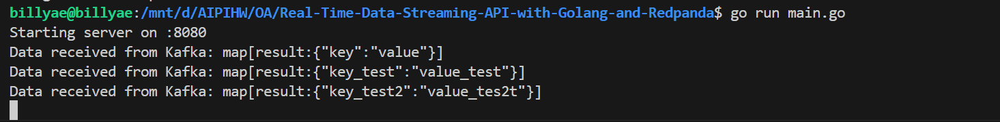

# Real-Time-Data-Streaming-API-with-Golang-and-Redpanda

### Set Up Redpanda (Kafka) with Docker:

docker run -d --name=redpanda -p 9092:9092 vectorized/redpanda redpanda start --overprovisioned --smp 1 --memory 1G --reserve-memory 0M --node-id 0 --check=false --kafka-addr PLAINTEXT://0.0.0.0:9092 --advertise-kafka-addr PLAINTEXT://localhost:9092

It will pulls the Redpanda Docker image if it is not already downloaded.   
And run a redpanda container optimized for development with minimal resource consumption.  
Configures Redpanda to expose Kafka functionally on localhost:9092.
Bind Kafka client connections to the container's port 9092.

### Start the Real-Time Data Streaming API

Start this WSL terminal and run the follong code:  
go run main.go

### Start a new stream  

curl -X POST http://localhost:8080/stream/start

### Send data to a stream

curl -X POST http://localhost:8080/stream/{stream_id}/send -H "Content-Type: application/json" -d '{"key":"value"}'

### Receive data to a stream

curl http://localhost:8080/stream/{stream_id}/results

It will create a process that will not terminate automatically. 

After this process is created, use the command above the send data to this stream and in the main WSL terminal you can see the data sent to this stream. 

### Check the metrics

curl http://localhost:8080/metrics

### Test Data

#### unit_test

go test ./unit_test/kafka_test.go -v

#### integrated_test

Start the stream: go test -v -run TestStartStream ./integrated_test

Send the data via the stream: streamid = {streamid}  go test -v -run TestSendData ./integrated_test

Start a receiving stream: streamid = {streamid}  go test -v -run TestGetResults ./integrated_test

